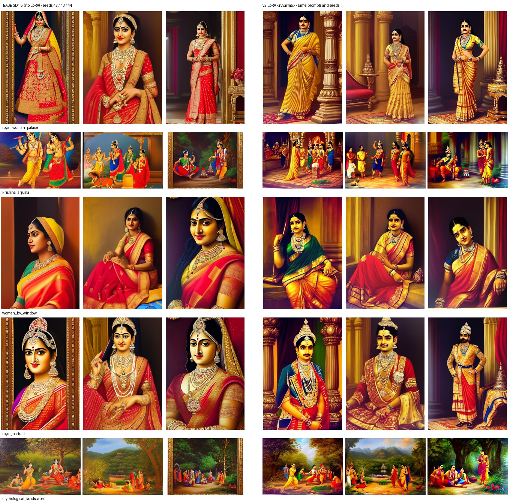
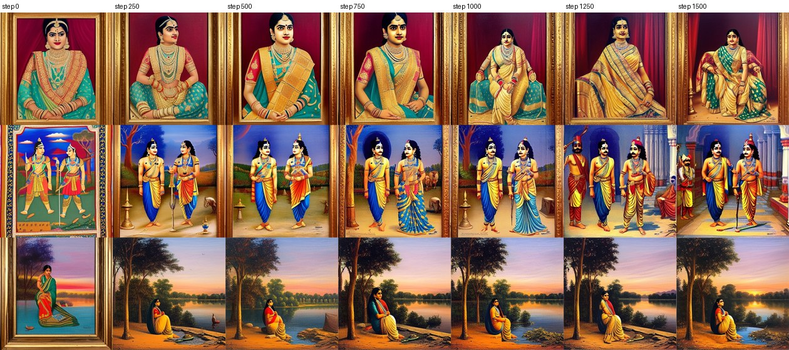
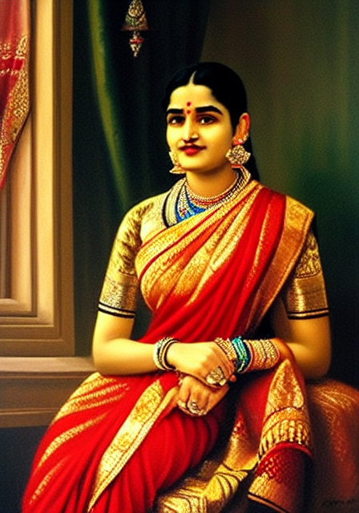
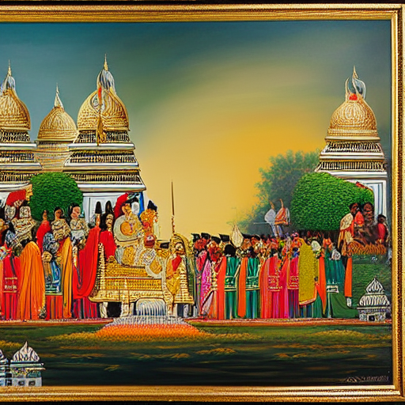
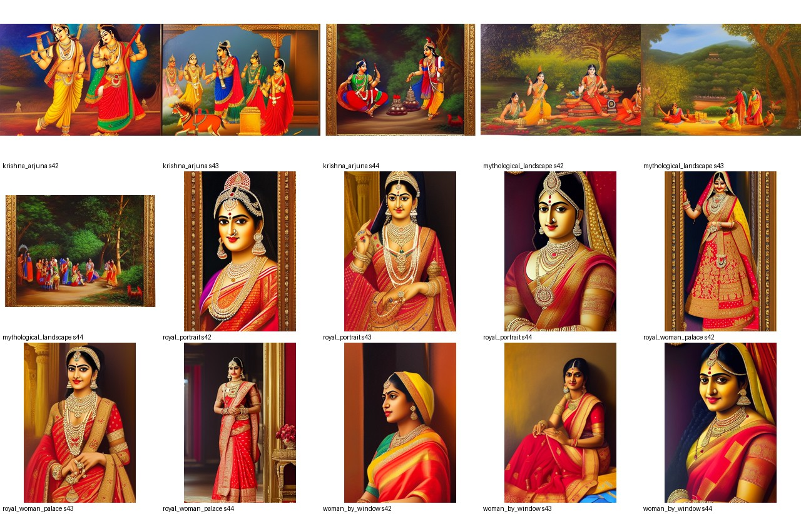

# The Next Ravi Varma

A text-to-image diffusion project that adapts **Stable Diffusion 1.5** with a **LoRA (PEFT)** adapter so it
generates new artwork inspired by the visual characteristics of **Raja Ravi Varma** (1848–1906) —
in the spirit of *The Next Rembrandt*, but with a modern diffusion + parameter-efficient fine-tuning stack.

> All generated images are AI-generated, Ravi Varma–*inspired* artwork. They are **not** authentic
> paintings by Raja Ravi Varma and must not be presented as such.

---

## Project status

| Milestone | Scope | Status |
|---|---|---|
| **1 — Corpus curation & multimodal captioning** | Wikimedia download with provenance, validation, curation, de-duplication, VLM template captions, preprocessing, manifest | ✅ **Complete** |
| **2 — Style-injected diffusion fine-tuning** | SD1.5 + LoRA trainer, checkpointing/resume, validation images, generation CLI, basic evaluation, Colab workflow | ✅ **Complete** — v2 LoRA trained (1500 steps, Colab T4), generated and evaluated; see *Current results* |
| **3 — Text parsing & semantic scene generation** | LLM prompt expansion / scene parser | ⏳ **Not yet implemented** |
| **4 — ControlNet guardrailing, evaluation & web panel** | OpenPose/Canny ControlNet, full evaluation framework, Gradio dashboard, checkpoint hub | ⏳ **Not yet implemented** |

The repository is at roughly the **50 % mark** of the proposal. Early prototype code for Milestones 3–4
exists from the initial project scaffold (`generation/prompt_engine.py`, `generation/controlnet.py`,
`app/`) — it is **unvalidated** and not part of the completed scope; it is exposed only behind
explicitly labelled preview flags (`generate.py --expand`, `--pose-image`).

---

## Current results (what has actually been run)

| Step | Where it ran | Result |
|---|---|---|
| Download | local | 200 Wikimedia Commons files, provenance for all 200 |
| Validation + curation | local | **134 accepted**, 66 excluded with reasons ([data/README.md](data/README.md)) |
| Captioning (BLIP-large + BLIP-VQA) | local, Apple MPS | 134 structured captions, all Q/A saved in `data/captions/` |
| Preparation | local | **122 training images** in aspect buckets + **12 held-out** reference paintings |
| Trainer verification | local, CPU | integration test on HF's 1 MB tiny SD model (`tests/test_training.py`) — **not** a real training run |
| Base-model baseline images | local, Apple MPS | 5 sample prompts × seeds 42/43/44 rendered **without** LoRA |
| **LoRA training v2** | **Colab T4** (runtime 2026.07, torch 2.11) | 20-step smoke test, then **1500 optimizer steps in 58 min**; 6 checkpoints + final weights (12.8 MB) |
| **LoRA images v2** | Colab T4 | same 5 prompts × 3 seeds with the LoRA (`outputs/generated/lora/`), plus checkpoints 750/1000/1250 (`outputs/generated/ckpt_*`) |
| Paired evaluation | Colab T4 | `outputs/evaluations/lora_vs_base/` |
| Local inference with the trained LoRA | local, Apple MPS | `outputs/generated/local_check/` — verifies the downloaded weights load and generate on the Mac |
| LoRA training v1 (earlier) | Colab T4 | trained on the earlier 39-image set; 4 sample images further below. Weights were not kept |

The weights are in `checkpoints/lora/ravi_varma/` (git-ignored; keep a copy in Drive). Loading them:
`python scripts/generate.py --prompt "<rvvarma>, ..." --seed 42` picks them up automatically.

### v2 LoRA vs base model (same prompts, same seeds)

<p align="center"></p>

**What the LoRA changes, consistently across seeds:**

- **Composition and staging move toward Varma.** "Royal woman in a palace" goes from a glossy bridal close-up to
  full-length standing figures with pillars, carpets and lamp stands; "royal portrait" becomes standing / seated
  maharaja-style court portraits; Krishna & Arjuna move into a pillared court interior.
- **No gilt frames: 0 / 15 LoRA images vs 5 / 15 for the base model** (same negative prompt). Frames were named in
  the training captions where present, so the trigger token did not absorb them.
- **Warmer, darker, painted backgrounds** instead of glossy digital rendering.

**Problems the LoRA introduces or keeps (not fixed at this milestone):**

- **Facial artifact:** several *women's* faces get a dark, moustache-like shadow on the upper lip
  (royal_woman_palace seeds 42–44, woman_by_window 42/43). The base model does not do this.
- **Signature-like scribbles** in bottom corners (woman_by_window 43/44, local check image): many training
  oleographs carry printed signatures/captions, and the captions do not mention them.
- Multi-figure mythological scenes stay saturated "poster" compositions; hands and faces in crowds remain weak.

**Training progression** — the 3 fixed validation prompts at every checkpoint (step 0 = untrained adapter;
the validation negative prompt does *not* exclude frames):

<p align="center"></p>

The style develops steadily up to step 1500 (frames disappear, the seated maharani composition and the pillared court
appear only after step 1000), so the final checkpoint is used by default. The loss stays flat around 0.17–0.18
throughout (mean 0.185 over steps 1–100, 0.174 over 1001–1500; `outputs/evaluations/lora_vs_base/loss_curve.png`),
which is normal for diffusion LoRA training — the per-step noise-prediction loss does not track style.

Local check on the Mac with the downloaded weights (seed 7, not one of the evaluation seeds):

<p align="center"></p>

**Automatic metrics** (CLIP ViT-B/32; 15 paired images, `outputs/evaluations/lora_vs_base/summary.json`):

| Metric | Base SD1.5 | v2 LoRA | Δ (LoRA higher in) |
|---|---|---|---|
| Prompt adherence (image–text cosine) | 0.328 | 0.317 | −0.011 (5/15) |
| Style similarity to 12 held-out paintings, mean | 0.669 | 0.681 | +0.012 (7/15) |
| Style similarity, top-3 references | 0.734 | 0.746 | +0.012 (7/15) |
| Diversity across seeds | 0.106 | 0.119 | +0.013 |
| Max similarity to any training image | — | 0.884 | no near-copies (threshold 0.95) |

Read honestly: the CLIP metrics show only a **small, inconsistent** shift — they barely register the composition,
framing and rendering changes that are obvious in the side-by-side, and the slight drop in prompt adherence is within
noise for 15 pairs. CLIP ViT-B/32 is a weak judge of painting style (see [docs/EVALUATION.md](docs/EVALUATION.md));
the human rubric in `outputs/evaluations/lora_vs_base/qualitative_review.csv` is still to be filled in.

### v1 preliminary results (earlier Colab run, 39-image dataset)

<p align="center">
  
  
  
  
</p>

Honest assessment of v1: the images show Indian-epic subject matter (ornate jewelry, saris, warm
saturated palette) but read as modern calendar/poster art rather than Varma's academic oil technique;
faces in multi-figure scenes are distorted (2nd image) and the 4th image has a painted gilt frame.
**Compared with the base-model baseline below, the v1 look is close to what plain SD1.5 already produces
for such prompts** (base SD1.5 also paints gilt frames), so the v1 adapter's style effect appears weak.
No paired base-vs-v1 comparison exists (different prompts/seeds, and the v1 weights were not kept), so this
is a qualitative judgement. It motivated the v2 data work below: more and cleaner data, real captions
(the frame is now named in captions where present) and aspect-correct crops.

### Base-model baseline on its own (SD1.5, no LoRA)

Rendered locally (Apple MPS, fp16, 30 steps, guidance 7.5) for the 5 prompts in
`configs/prompts/sample_prompts.yaml` × seeds 42/43/44 → `outputs/generated/baseline/` (15 images with sidecar JSON).

<p align="center"></p>

What base SD1.5 does with these prompts: a glossy, frontal, saturated "calendar art" look with hard
lighting — none of Varma's soft academic modelling of skin and drapery; gilt **frames in 5 of 15 images**
despite `frame, border` in the negative prompt (the phrase "classical oil painting" pulls frames in);
ambiguous identities in the multi-figure mythological scenes. This is the reference the v2 LoRA has to beat.

Automatic metrics for this baseline (`outputs/evaluations/baseline_sd15/summary.json`, CLIP ViT-B/32):

| Metric | Baseline (SD1.5, no LoRA) |
|---|---|
| Prompt adherence (image–text cosine) | 0.328 |
| Style similarity to 12 held-out paintings (mean / top-3) | 0.669 / 0.734 |
| Diversity across seeds (mean pairwise distance) | 0.106 |
| Max similarity to any training image | 0.868 (no near-copies) |

These are the base-model columns of the paired table above.

---

## What changed for v2 (and why)

| Problem found | Fix |
|---|---|
| Uncommitted manifest had placeholder captions ("unknown (no VLM available…)") for all 200 images and the metadata file was emptied | Metadata rebuilt from verifiable sources (committed records + download log); captioner now refuses to silently fall back to placeholder captions |
| 26 local images were upscaled from originals as small as 200 px, passing the 384 px check | Original sizes fetched from Commons into metadata; validation checks the original resolution |
| Same artwork present 2–5× (prints, crops, re-scans) | 22 curated duplicate groups + automatic dHash near-duplicate detection; highest-resolution copy kept |
| Stamps, gallery photos, multi-panel grids, text-labelled prints in the corpus | Curated exclusion list with a reason per file (`configs/dataset.yaml`) |
| Square 512 center-crop cut heads/feet off the mostly tall canvases | Aspect-ratio buckets (448×640, 512×512, …); scanner margins trimmed |
| Captions were a single BLIP sentence | BLIP sentence + fixed BLIP-VQA template (clothing, colour, jewelry, posture, action, expression, held object, setting, day/night) + measured palette, fit to CLIP's 77 tokens; artwork title from provenance |
| `runwayml/stable-diffusion-v1-5` no longer exists on the Hub | Switched to the official mirror `stable-diffusion-v1-5/stable-diffusion-v1-5` (identical weights) |
| LR warm-up silently 4× too long (multiplied by grad-accumulation) | Warm-up/total steps expressed in optimizer steps, as in the Diffusers reference |
| Loss logged from one micro-batch only; no loss file | Mean over accumulated micro-batches, `loss_history.csv` + TensorBoard |
| Only final weights exportable; validation rebuilt the pipeline from disk with mixed dtypes | Every checkpoint saves a loadable `pytorch_lora_weights.safetensors`; fixed-seed multi-prompt validation re-uses loaded modules, incl. a step-0 baseline |
| `xformers==0.0.27.post2` in Colab requirements pins `torch==2.4.0` → downgraded Colab torch → torchao mismatch | xformers removed (PyTorch SDPA used); guarded torchao check kept in the notebook |
| `bitsandbytes==0.43.3` has no CUDA 12.8 binary and imports `triton.ops` (gone in Triton 3); PEFT imports it when installed → LoRA injection crashed on Colab | bitsandbytes dropped, `use_8bit_adam: false` (8-bit Adam saved only ~19 MB for 3.2M LoRA params) |
| No held-out data for evaluation | 12 accepted paintings held out in `data/reference/`, never trained on |

---

## Architecture

```
Wikimedia Commons ──download──▶ data/raw/ ──validate/curate──▶ accepted list
                                                    │
                       BLIP-large caption + BLIP-VQA template ──▶ data/captions/*.json
                                                    │
                    trim borders, aspect buckets, trigger token ──▶ data/processed/ + manifest.jsonl
                                                    │                 data/reference/ (held out)
                                                    ▼
      SD1.5 (frozen, fp16)  +  LoRA r=16 on UNet attention (fp32)  ──train──▶ pytorch_lora_weights.safetensors
                                                    │
                    StableDiffusionPipeline + load_lora_weights ──▶ outputs/generated/*.png + .json
                                                    │
                     CLIP metrics vs held-out set + baseline + human rubric ──▶ outputs/evaluations/
```

```text
configs/            dataset.yaml (curation, buckets) · lora_sd15.yaml · generation.yaml · prompts/sample_prompts.yaml
src/ravi_varma/
  data/             validation.py · captions.py · metadata.py · dataset.py (prep, dataset, bucket sampler)
  training/         lora_trainer.py · callbacks.py (checkpoints, validation images, loss log)
  generation/       pipeline.py · prompt_engine.py (M3 prototype) · controlnet.py (M4 prototype)
  evaluation/       run_eval.py · clip_score.py · style_similarity.py · report.py
  utils/            image.py (hashing, buckets, border trim) · device.py · logging.py
scripts/            download · validate · generate_captions · prepare · package_dataset · train_lora · generate · evaluate
notebooks/          03_lora_training.ipynb (Colab end-to-end)
tests/              101 tests (99 run here; 2 cover the no-CLIP path) incl. a tiny-model trainer test
docs/EVALUATION.md  evaluation protocol, rubric, metric limitations
```

### Dataset pipeline
`validate_dataset.py` decides, for every raw file, *accepted* or *excluded + reason*: unsupported format,
corrupt/truncated, below 384 px (checked against the **original** Commons size), curated exclusion,
exact duplicate, curated duplicate group, automatic near-duplicate (256-bit difference hash, Hamming ≤ 40).
Captioning and preparation re-run the validator, so all stages agree on the same set.

### Captioning
`Salesforce/blip-image-captioning-large` writes one sentence; `Salesforce/blip-vqa-base` answers a fixed
question list. Follow-ups are gated (only ask *what* jewelry if "is she wearing jewelry?" is *yes*).
Answers that describe the medium ("in painting", "museum") or name objects impossible in a 19th-century
painting ("phone") are dropped, not guessed around. Style words are deliberately **left out** of captions
so the `<rvvarma>` token absorbs the painterly style. Example:

> `<rvvarma>, Hamsa Damayanti, a woman in a red sari feeding a white swan, wearing red dress, necklace jewelry, sitting, calm expression, in park, single-figure composition, vertical format, mid-tone lighting, warm red and ochre palette`

(Real caption from `data/processed/manifest.jsonl`. Note the remaining VQA imprecision — "red dress" for a
sari, "park" for a palace garden — which is typical of BLIP-VQA and documented under *Limitations*.)

### LoRA
PEFT LoRA on the UNet attention projections `to_q, to_k, to_v, to_out.0`; base UNet, VAE and text
encoder frozen (asserted at start-up: only parameters named `lora` are trainable). Trigger token
`<rvvarma>` is plain text in every caption (the text encoder is frozen; CLIP tokenises it into rare
sub-tokens the adapter learns to associate with the style).

### Training configuration (`configs/lora_sd15.yaml`)

| Parameter | Value | Note |
|---|---|---|
| Base model | `stable-diffusion-v1-5/stable-diffusion-v1-5` | official mirror |
| Rank / alpha / dropout | 16 / 16 / 0.05 | unchanged |
| Target modules | `to_k, to_q, to_v, to_out.0` | unchanged |
| Learning rate | 1e-4, constant, 100 warm-up steps | warm-up now really 100 optimizer steps |
| Batch / grad. accumulation | 1 / 4 | unchanged |
| Max steps | 1500 optimizer steps (≈ 49 epochs of 122 images) | unchanged |
| Precision | fp16 (frozen weights fp16, LoRA params fp32) | Diffusers reference layout |
| Seed | 42 | unchanged |
| Resolution | aspect buckets ≈ 512² (448×640 most common) | was square 512 crop |
| Checkpoints | every 250 steps, keep 6 | was keep 5 → now all six are kept for checkpoint selection |
| Validation | 3 fixed prompts × fixed seed every 250 steps + step 0 | was 1 prompt |

---

## Reproducing the experiment

```
DATASET → VALIDATION → CAPTIONING → PREPARATION → (package) → LORA TRAINING → CHECKPOINT → GENERATION → EVALUATION
└──────────────── local machine (CPU / Apple MPS) ─────────┘   └───── CUDA GPU (Colab T4) ─────┘   └─ either ─┘
```

### Local workflow (Mac / CPU) — dataset, captions, inference

```bash
python -m venv .venv && source .venv/bin/activate
pip install -r requirements.txt && pip install -e .

python scripts/download_dataset.py --from-metadata   # exact files from metadata.jsonl (~1 h, Wikimedia rate limits)
python scripts/validate_dataset.py                    # -> data/metadata/validation_report.json
python scripts/generate_captions.py                   # BLIP + BLIP-VQA (~45 min for 134 images on an 8 GB Apple-silicon Mac)
python scripts/prepare_dataset.py                     # -> data/processed/ + manifest.jsonl, data/reference/
python scripts/validate_dataset.py --manifest         # integrity check of what training will read
python scripts/package_dataset.py                     # -> dist/ravi_varma_dataset.zip (~30 MB) for Colab
pytest -v
```

### GPU workflow (Colab T4) — training

Open `notebooks/03_lora_training.ipynb` in Colab (Runtime → Change runtime type → **T4 GPU**, **Runtime version 2026.07**
— the last Python 3.12 image; the pinned stack has no Python 3.13 wheels) and run top to bottom. It:
verifies the GPU → installs `requirements-colab.txt` (keeps Colab's torch) → handles torchao →
loads `ravi_varma_dataset.zip` → checks the manifest → shows captions → **20-step smoke test** →
**full training** → plots loss / shows validation grids → renders the sample prompts with LoRA and
base model → evaluates → downloads `ravi_varma_results.zip`.

Equivalent commands on any CUDA machine (or `bash scripts/colab_train.sh`, which runs the whole GPU pipeline):

```bash
pip install -r requirements-colab.txt && pip install -e . --no-deps
python scripts/train_lora.py --config configs/lora_sd15.yaml --smoke-test   # ~3 min sanity check
python scripts/train_lora.py --config configs/lora_sd15.yaml                # resumes automatically if interrupted
```

Outputs in `checkpoints/lora/ravi_varma/`: `pytorch_lora_weights.safetensors`, `training_config.yaml`,
`training_summary.json`, `loss_history.csv`, `checkpoint-{250…1500}/` (each with its own LoRA file);
validation grids in `outputs/logs/validation_images/step_XXXXX/`.

### Generation (after copying the trained LoRA back: `unzip -o ravi_varma_results.zip`)

```bash
python scripts/generate.py --prompt "<rvvarma>, royal Indian portrait, elaborate textile details, jewelry, classical oil painting" --seed 42

python scripts/generate.py --prompt-file configs/prompts/sample_prompts.yaml --seeds 42 43 44 --output-dir outputs/generated/lora
python scripts/generate.py --prompt-file configs/prompts/sample_prompts.yaml --seeds 42 43 44 --no-lora --output-dir outputs/generated/baseline
```

Options: `--negative-prompt`, `--seed/--seeds/--num-images`, `--steps`, `--guidance-scale`,
`--width/--height`, `--lora-scale`, `--lora-path` (final dir, `checkpoint-<step>` dir or `.safetensors`),
`--no-lora`, `--output-dir`. Every image gets a sidecar `.json` with everything needed to regenerate it.
Seeds use a CPU generator, so a seed gives the same image on CUDA, MPS and CPU (up to kernel-level numerics).
On an 8 GB Apple-silicon Mac (MPS, fp16) a 30-step image takes about 1 minute. Attention slicing is
automatically left **off** on MPS: combined with fp16 it produces NaN latents (all-black images) under torch 2.4;
the generator also refuses to save an all-black image.

### Evaluation

```bash
python scripts/evaluate.py --input outputs/generated/lora --baseline outputs/generated/baseline \
    --output-dir outputs/evaluations/lora_vs_base
```

CLIP prompt adherence, style similarity to the 12 held-out paintings, per-prompt diversity and a
memorisation check, all reported **paired against the base model** on identical prompts/seeds, plus a
contact sheet and a 1–5 human rubric (visual quality, anatomy, style, prompt) in
`qualitative_review.csv`. What these numbers do and do not mean: [docs/EVALUATION.md](docs/EVALUATION.md).
Results of this evaluation for the v2 LoRA are in *Current results* above.

---

## Limitations

- **Small corpus.** 122 training paintings after curation; many are oleograph *prints* from the Ravi
  Varma Press rather than photographs of oil canvases, which pulls the style toward flatter print colours.
- **VQA captions are imperfect.** BLIP-VQA misreads some details (held objects such as "tie" or "phone"
  — now filtered — and occasionally wrong colours or postures). Every answer is stored for auditing and can
  be corrected and re-assembled with `generate_captions.py --reflatten`.
- **SD1.5 anatomy.** Hands, faces in crowds and limb counts remain the base model's weak points; the LoRA
  and negative prompts reduce but do not fix this (Milestone 4 adds pose conditioning).
- **Evaluation is coarse.** CLIP-based scores mix content with style and are blind to anatomy; only paired
  comparisons against the base model are meaningful, and anatomy/quality need human ratings.
- **LoRA artifacts.** The v2 LoRA adds a moustache-like upper-lip shadow to some women's faces and
  signature-like scribbles in image corners (learned from printed signatures on oleographs). Both are visible
  in the side-by-side above; neither is fixed at this milestone.
- **The fp16 CUDA training path is exercised on Colab, not in the local test suite** (the tiny-model
  integration test runs in fp32 on CPU).

## Future work (remaining ~50 %)

- **Milestone 3** — LLM prompt expansion and a semantic scene parser that turns epic narratives
  (e.g. "Yudhishthira weeping over Karna at Kurukshetra") into attribute-rich prompts with the trigger token.
- **Milestone 4** — OpenPose/Canny ControlNet conditioning for dignified, balanced poses; the full
  multimodal evaluation framework; a Gradio dashboard (text + pose reference → image); a LoRA checkpoint
  hub with per-checkpoint loss curves.
- Fix the two v2 LoRA artifacts: name printed signatures/caption strips in the training captions (as was done
  for frames) or crop them, and inspect which training portraits drive the upper-lip shadow; then compare
  checkpoints with the filled-in human rubric.
- Dataset: replace low-resolution and print-only works with higher-quality museum scans where licenses allow;
  hand-correct VQA errors in the caption sidecars.

## Ethics, licensing and attribution

Raja Ravi Varma's works are in the public domain; the digital reproductions used here are from Wikimedia
Commons — 193 public domain, the rest CC BY 4.0, CC BY-SA 2.0/4.0 or GODL-India, recorded per image in
`data/metadata/metadata.jsonl`. Image files are not redistributed in this repository. Generated images are
labelled as AI-generated in their metadata.

Code is released under the [LICENSE](LICENSE) in this repository.
